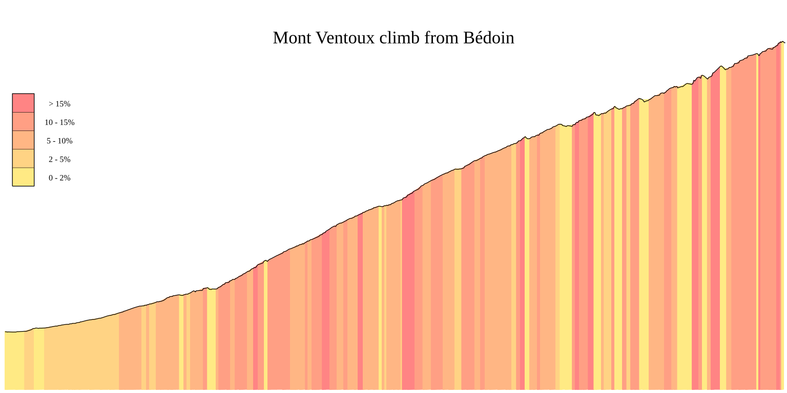

# Elevate

A vector graphics elevation profile drawer using gonum/plot and a gpx as input

## Usage

```
$ go run main.go path/to/route.gpx
```

## Example

Using this gpx as input: https://www.routeyou.com/nl-fr/route/view/249356/racefietsroute/mont-ventoux-de-klim-vanaf-bedoin


